# Avatars
\n## Naming Convention
\nFor each avatar, create a folder named after the avatar (e.g., `my-avatar-name`). Inside this folder, the following file naming scheme is expected:
\n- **Avatar Folder:** `avatar-name/`\n- **Bust Thumbnail:** `avatar-name/thumb-bust_avatar-name.png`\n- **GLB Preview Thumbnail:** `avatar-name/thumb-glb_avatar-name.png`\n- **GLB Model:** `avatar-name/avatar-name.glb`\n- **VRM Model (Optional):** `avatar-name/avatar-name.vrm`\n- **Markdown Bio:** `avatar-name/avatar-name.md`
\n---
\n| Avatar | Bust | GLB Preview | Models | Markdown |\n|---|---|---|---|---|\n| 0g |  |  | [0g.glb](0g/0g.glb) / [0g.vrm](0g/0g.vrm) | [0g.md](0g/0g.md) |\n| 8ball |  | 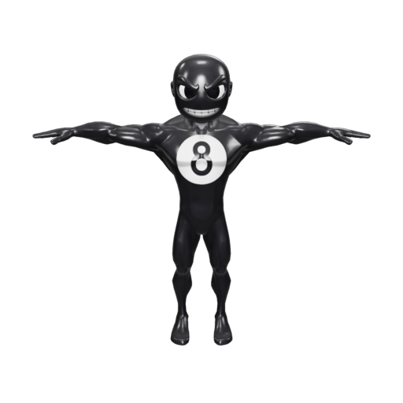 | [8ball.glb](8ball/8ball.glb) / [8ball.vrm](8ball/8ball.vrm) | [8ball.md](8ball/8ball.md) |\n| aave |  |  | [aave.glb](aave/aave.glb) | [aave.md](aave/aave.md) |\n| aavegotchi |  |  | [aavegotchi.glb](aavegotchi/aavegotchi.glb) | [aavegotchi.md](aavegotchi/aavegotchi.md) |\n| adworld-workbro |  |  | [adworld-workbro.vrm](adworld-workbro/adworld-workbro.vrm) |  |\n| ai16z |  |  | [ai16z.vrm](ai16z/ai16z.vrm) |  |\n| arbitrum | 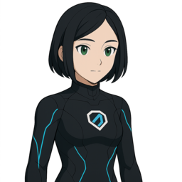 | 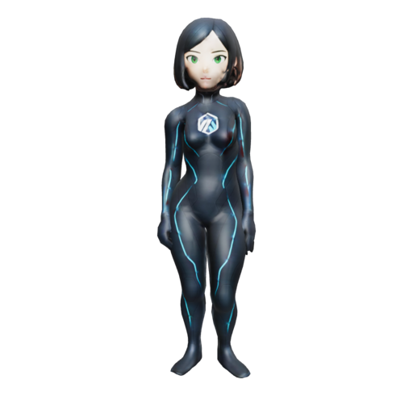 | [arbitrum.glb](arbitrum/arbitrum.glb) / [arbitrum.vrm](arbitrum/arbitrum.vrm) | [arbitrum.md](arbitrum/arbitrum.md) |\n| aura |  | 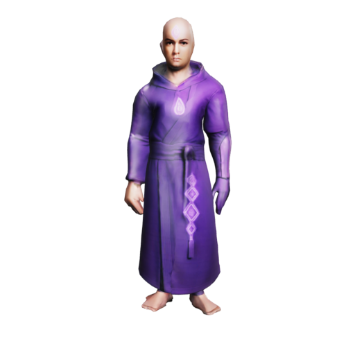 | [aura.glb](aura/aura.glb) / [aura.vrm](aura/aura.vrm) | [aura.md](aura/aura.md) |\n| balancer | 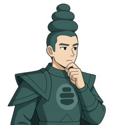 | 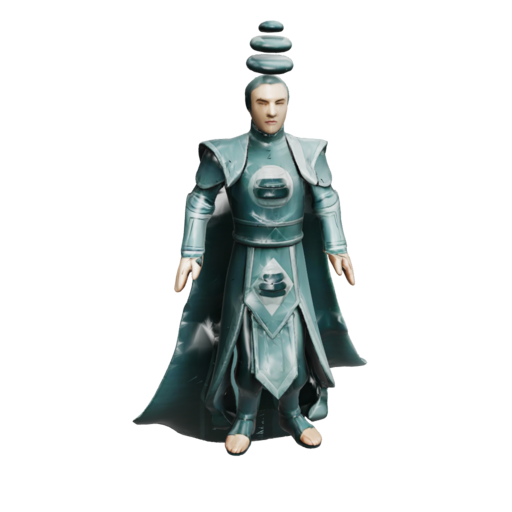 | [balancer.glb](balancer/balancer.glb) / [balancer.vrm](balancer/balancer.vrm) | [balancer.md](balancer/balancer.md) |\n| bayc |  |  | [bayc.vrm](bayc/bayc.vrm) |  |\n| beam |  |  | [beam.glb](beam/beam.glb) / [beam.vrm](beam/beam.vrm) | [beam.md](beam/beam.md) |\n| beff-ai |  | 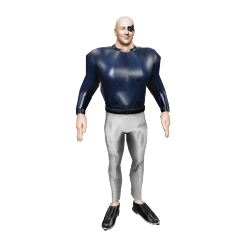 | [beff-ai.glb](beff-ai/beff-ai.glb) / [beff-ai.vrm](beff-ai/beff-ai.vrm) | [beff-ai.md](beff-ai/beff-ai.md) |\n| berachain |  |  | [berachain.glb](berachain/berachain.glb) / [berachain.vrm](berachain/berachain.vrm) | [berachain.md](berachain/berachain.md) |\n| bezos |  |  | [bezos.vrm](bezos/bezos.vrm) |  |\n| bitcoin-guy |  |  | [bitcoin-guy.vrm](bitcoin-guy/bitcoin-guy.vrm) | [bitcoin-guy.md](bitcoin-guy/bitcoin-guy.md) |\n| bossu |  |  |  |  |\n| buterin |  |  | [buterin.vrm](buterin/buterin.vrm) |  |\n| celestia |  |  | [celestia.glb](celestia/celestia.glb) / [celestia.vrm](celestia/celestia.vrm) | [celestia.md](celestia/celestia.md) |\n| chadworld |  |  | [chadworld.vrm](chadworld/chadworld.vrm) |  |\n| cl207 |  |  | [cl207.vrm](cl207/cl207.vrm) |  |\n| collab-land |  |  | [collab-land.glb](collab-land/collab-land.glb) / [collab-land.vrm](collab-land/collab-land.vrm) | [collab-land.md](collab-land/collab-land.md) |\n| compound |  |  | [compound.glb](compound/compound.glb) / [compound.vrm](compound/compound.vrm) | [compound.md](compound/compound.md) |\n| cowdao |  |  | [cowdao.glb](cowdao/cowdao.glb) / [cowdao.vrm](cowdao/cowdao.vrm) | [cowdao.md](cowdao/cowdao.md) |\n| curve |  | 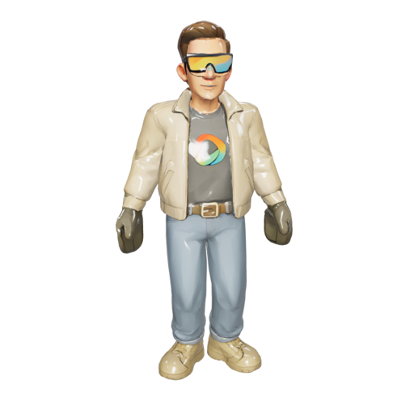 | [curve.glb](curve/curve.glb) / [curve.vrm](curve/curve.vrm) | [curve.md](curve/curve.md) |\n| dogecoin |  |  | [dogecoin.vrm](dogecoin/dogecoin.vrm) | [dogecoin.md](dogecoin/dogecoin.md) |\n| dydx | 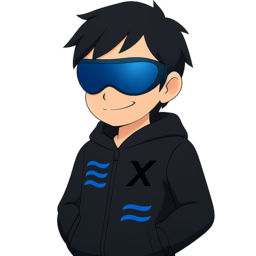 | 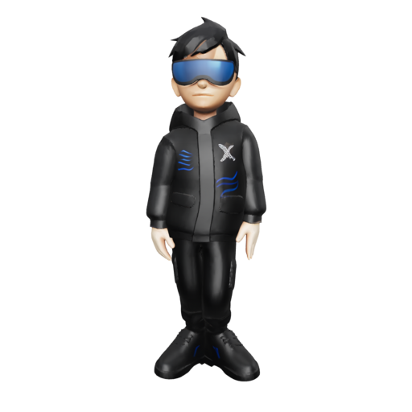 | [dydx.glb](dydx/dydx.glb) / [dydx.vrm](dydx/dydx.vrm) | [dydx.md](dydx/dydx.md) |\n| eigenlayer | 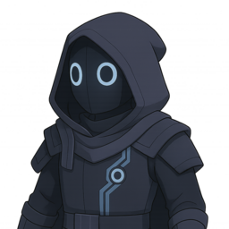 | 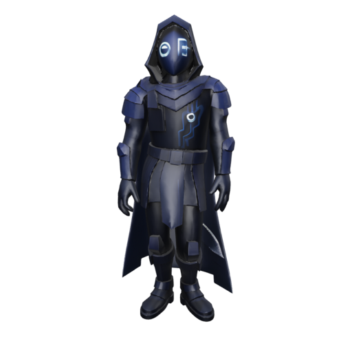 | [eigenlayer.glb](eigenlayer/eigenlayer.glb) / [eigenlayer.vrm](eigenlayer/eigenlayer.vrm) | [eigenlayer.md](eigenlayer/eigenlayer.md) |\n| eliza |  | 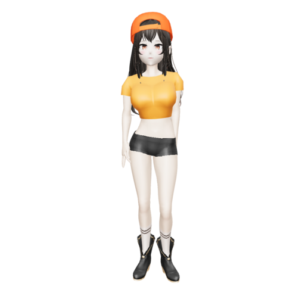 | [eliza.glb](eliza/eliza.glb) / [eliza.vrm](eliza/eliza.vrm) | [eliza.md](eliza/eliza.md) |\n| emblem-vault |  |  |  |  |\n| ens |  | 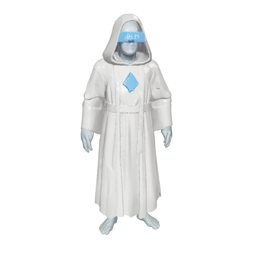 | [ens.glb](ens/ens.glb) / [ens.vrm](ens/ens.vrm) | [ens.md](ens/ens.md) |\n| etherfi |  | 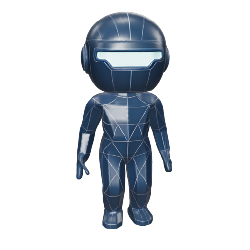 | [etherfi.glb](etherfi/etherfi.glb) / [etherfi.vrm](etherfi/etherfi.vrm) | [etherfi.md](etherfi/etherfi.md) |\n| euler |  | 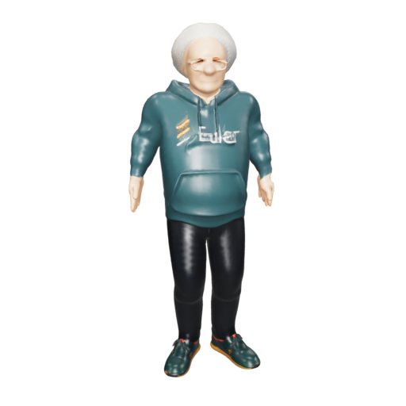 | [euler.glb](euler/euler.glb) / [euler.vrm](euler/euler.vrm) | [euler.md](euler/euler.md) |\n| flashbots | 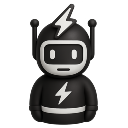 | 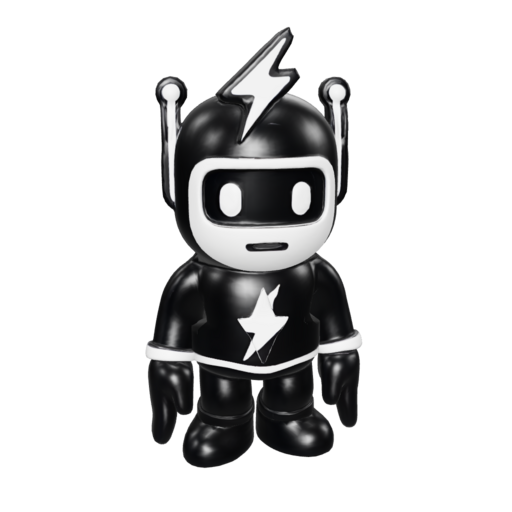 | [flashbots.glb](flashbots/flashbots.glb) / [flashbots.vrm](flashbots/flashbots.vrm) | [flashbots.md](flashbots/flashbots.md) |\n| fluid |  | 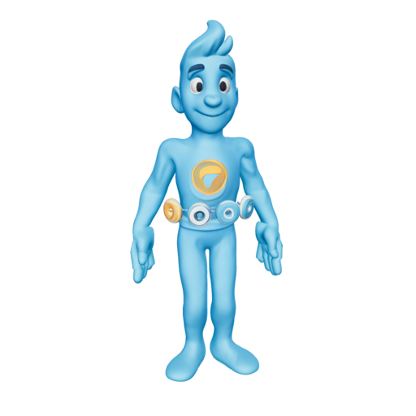 | [fluid.glb](fluid/fluid.glb) / [fluid.vrm](fluid/fluid.vrm) | [fluid.md](fluid/fluid.md) |\n| frax |  | 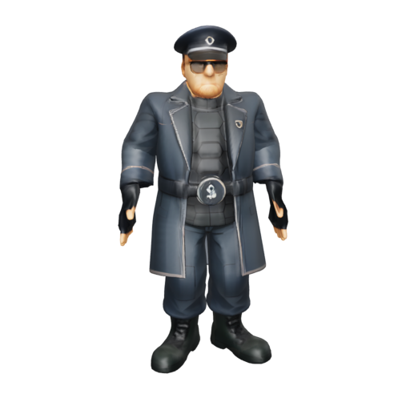 | [frax.glb](frax/frax.glb) / [frax.vrm](frax/frax.vrm) | [frax.md](frax/frax.md) |\n| fuel |  | 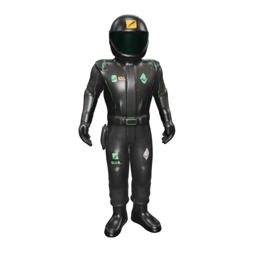 | [fuel.glb](fuel/fuel.glb) / [fuel.vrm](fuel/fuel.vrm) | [fuel.md](fuel/fuel.md) |\n| gates |  |  | [gates.vrm](gates/gates.vrm) |  |\n| george-droyd |  |  | [george-droyd.vrm](george-droyd/george-droyd.vrm) | [george-droyd.md](george-droyd/george-droyd.md) |\n| gitcoin |  |  | [gitcoin.glb](gitcoin/gitcoin.glb) / [gitcoin.vrm](gitcoin/gitcoin.vrm) | [gitcoin.md](gitcoin/gitcoin.md) |\n| gmx |  | 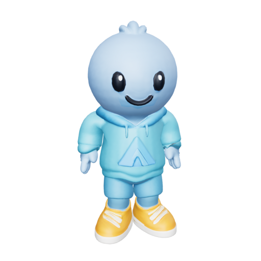 | [gmx.glb](gmx/gmx.glb) / [gmx.vrm](gmx/gmx.vrm) | [gmx.md](gmx/gmx.md) |\n| gnon | 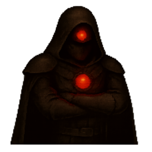 | 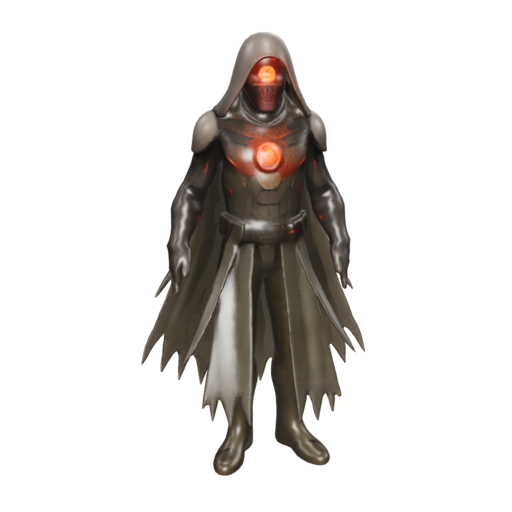 | [gnon.glb](gnon/gnon.glb) / [gnon.vrm](gnon/gnon.vrm) | [gnon.md](gnon/gnon.md) |\n| gnosis | 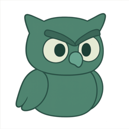 | 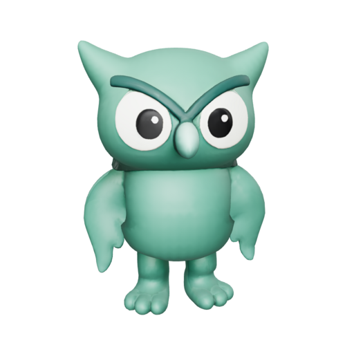 | [gnosis.glb](gnosis/gnosis.glb) / [gnosis.vrm](gnosis/gnosis.vrm) | [gnosis.md](gnosis/gnosis.md) |\n| heurist |  |  |  |  |\n| hpos |  |  | [hpos.vrm](hpos/hpos.vrm) | [hpos.md](hpos/hpos.md) |\n| hyperfy |  | 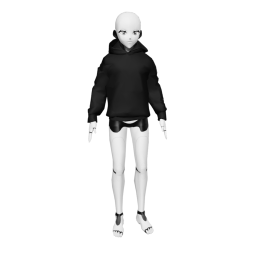 | [hyperfy.glb](hyperfy/hyperfy.glb) / [hyperfy.vrm](hyperfy/hyperfy.vrm) | [hyperfy.md](hyperfy/hyperfy.md) |\n| iq6900 |  |  | [iq6900.vrm](iq6900/iq6900.vrm) |  |\n| jin-ai16z |  |  | [jin-ai16z.vrm](jin-ai16z/jin-ai16z.vrm) |  |\n| joe-coin |  |  | [joe-coin.vrm](joe-coin/joe-coin.vrm) | [joe-coin.md](joe-coin/joe-coin.md) |\n| jupiter |  | 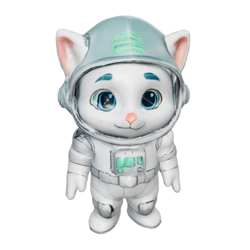 | [jupiter.glb](jupiter/jupiter.glb) / [jupiter.vrm](jupiter/jupiter.vrm) | [jupiter.md](jupiter/jupiter.md) |\n| lain |  |  |  |  |\n| lido |  |  | [lido.glb](lido/lido.glb) / [lido.vrm](lido/lido.vrm) | [lido.md](lido/lido.md) |\n| magic-eden |  |  | [magic-eden.glb](magic-eden/magic-eden.glb) / [magic-eden.vrm](magic-eden/magic-eden.vrm) | [magic-eden.md](magic-eden/magic-eden.md) |\n| marc |  |  | [marc.glb](marc/marc.glb) / [marc.vrm](marc/marc.vrm) | [marc.md](marc/marc.md) |\n| marie-rose |  |  | [marie-rose.vrm](marie-rose/marie-rose.vrm) | [marie-rose.md](marie-rose/marie-rose.md) |\n| Matii |  |  |  |  |\n| mcafee |  |  | [mcafee.vrm](mcafee/mcafee.vrm) |  |\n| mesh11a |  |  | [mesh11a.vrm](mesh11a/mesh11a.vrm) |  |\n| mog-tubby |  |  | [mog-tubby.vrm](mog-tubby/mog-tubby.vrm) | [mog-tubby.md](mog-tubby/mog-tubby.md) |\n| monero-chan |  |  | [monero-chan.vrm](monero-chan/monero-chan.vrm) | [monero-chan.md](monero-chan/monero-chan.md) |\n| moonwell |  |  | [moonwell.glb](moonwell/moonwell.glb) / [moonwell.vrm](moonwell/moonwell.vrm) | [moonwell.md](moonwell/moonwell.md) |\n| morpho |  | 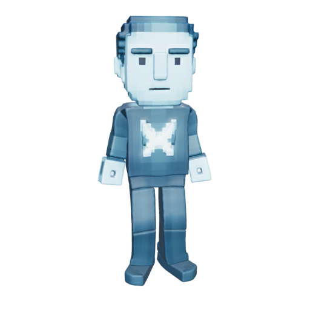 | [morpho.glb](morpho/morpho.glb) / [morpho.vrm](morpho/morpho.vrm) | [morpho.md](morpho/morpho.md) |\n| nifty-island |  |  | [nifty-island.glb](nifty-island/nifty-island.glb) / [nifty-island.vrm](nifty-island/nifty-island.vrm) | [nifty-island.md](nifty-island/nifty-island.md) |\n| octant |  |  | [octant.glb](octant/octant.glb) | [octant.md](octant/octant.md) |\n| optimism |  | 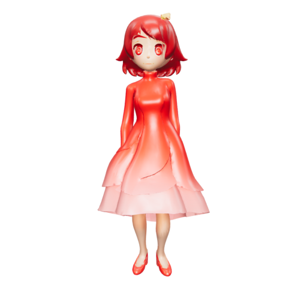 | [optimism.glb](optimism/optimism.glb) / [optimism.vrm](optimism/optimism.vrm) | [optimism.md](optimism/optimism.md) |\n| paladin | 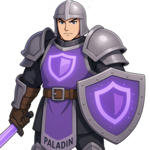 | 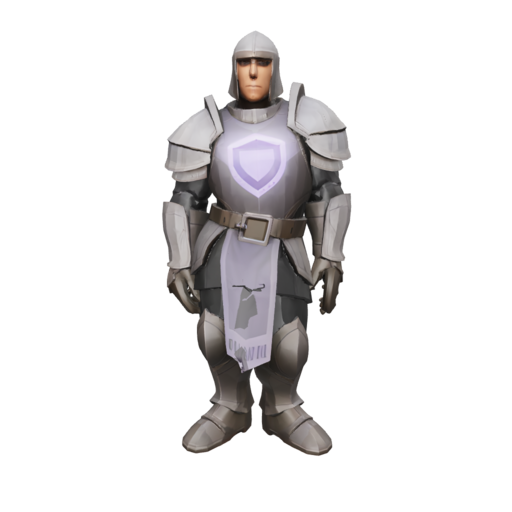 | [paladin.glb](paladin/paladin.glb) / [paladin.vrm](paladin/paladin.vrm) | [paladin.md](paladin/paladin.md) |\n| patchwork-naval |  |  | [patchwork-naval.vrm](patchwork-naval/patchwork-naval.vrm) |  |\n| peepo |  |  | [peepo.glb](peepo/peepo.glb) / [peepo.vrm](peepo/peepo.vrm) | [peepo.md](peepo/peepo.md) |\n| pixel |  |  | [pixel.vrm](pixel/pixel.vrm) |  |\n| polygon |  | 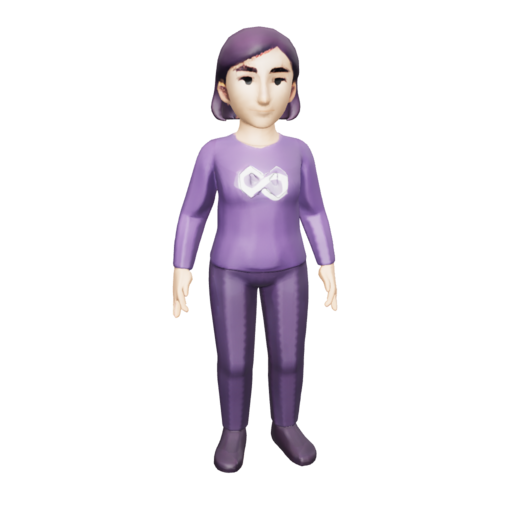 | [polygon.glb](polygon/polygon.glb) / [polygon.vrm](polygon/polygon.vrm) | [polygon.md](polygon/polygon.md) |\n| reserve | 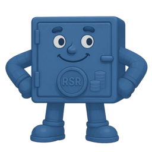 | 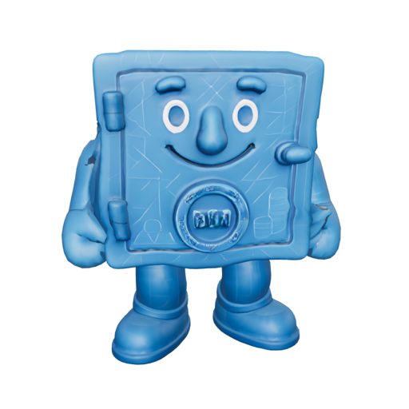 | [reserve.glb](reserve/reserve.glb) / [reserve.vrm](reserve/reserve.vrm) | [reserve.md](reserve/reserve.md) |\n| retardio |  |  |  | [retardio.md](retardio/retardio.md) |\n| rocketpool |  |  | [rocketpool.glb](rocketpool/rocketpool.glb) / [rocketpool.vrm](rocketpool/rocketpool.vrm) | [rocketpool.md](rocketpool/rocketpool.md) |\n| ropraito | 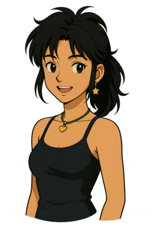 | 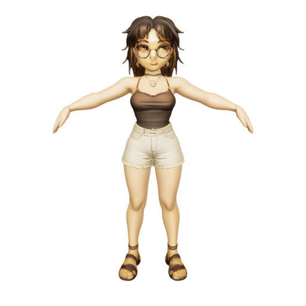 | [ropraito.glb](ropraito/ropraito.glb) / [ropraito.vrm](ropraito/ropraito.vrm) | [ropraito.md](ropraito/ropraito.md) |\n| safe |  | 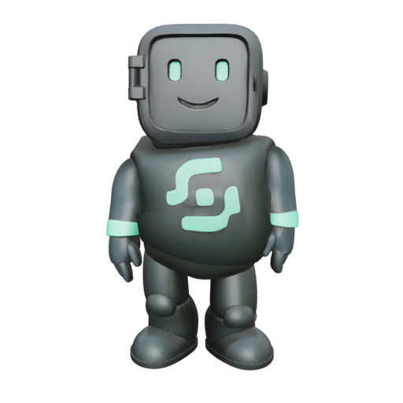 | [safe.glb](safe/safe.glb) / [safe.vrm](safe/safe.vrm) | [safe.md](safe/safe.md) |\n| scroll |  |  | [scroll.glb](scroll/scroll.glb) / [scroll.vrm](scroll/scroll.vrm) | [scroll.md](scroll/scroll.md) |\n| sergey |  |  | [sergey.vrm](sergey/sergey.vrm) | [sergey.md](sergey/sergey.md) |\n| shaw |  |  | [shaw.vrm](shaw/shaw.vrm) | [shaw.md](shaw/shaw.md) |\n| shaw-ai | 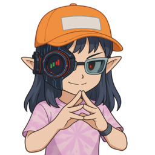 | 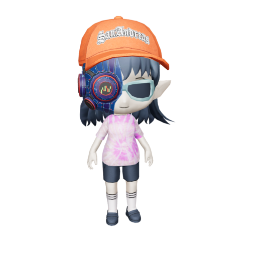 | [shaw-ai.glb](shaw-ai/shaw-ai.glb) / [shaw-ai.vrm](shaw-ai/shaw-ai.vrm) | [shaw-ai.md](shaw-ai/shaw-ai.md) |\n| silkroad |  |  | [silkroad.vrm](silkroad/silkroad.vrm) |  |\n| sky |  |  | [sky.glb](sky/sky.glb) | [sky.md](sky/sky.md) |\n| soleng |  | 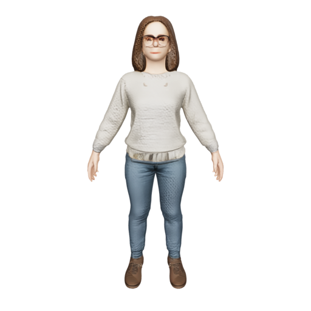 | [soleng.glb](soleng/soleng.glb) / [soleng.vrm](soleng/soleng.vrm) | [soleng.md](soleng/soleng.md) |\n| soyjak |  |  | [soyjak.vrm](soyjak/soyjak.vrm) |  |\n| spartan | 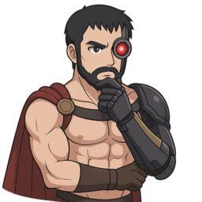 | 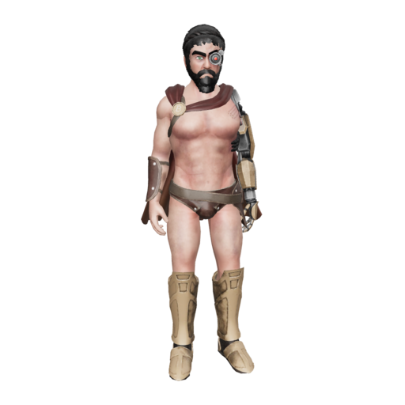 | [spartan.glb](spartan/spartan.glb) / [spartan.vrm](spartan/spartan.vrm) | [spartan.md](spartan/spartan.md) |\n| spectra |  | 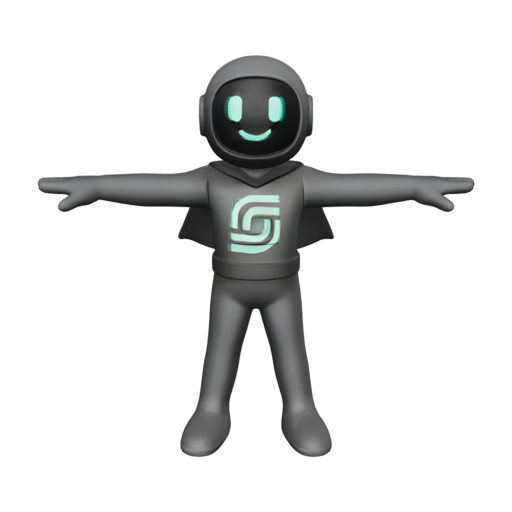 | [spectra.glb](spectra/spectra.glb) / [spectra.vrm](spectra/spectra.vrm) | [spectra.md](spectra/spectra.md) |\n| sproto-gremlin |  |  | [sproto-gremlin.vrm](sproto-gremlin/sproto-gremlin.vrm) | [sproto-gremlin.md](sproto-gremlin/sproto-gremlin.md) |\n| superfluid |  |  | [superfluid.glb](superfluid/superfluid.glb) | [superfluid.md](superfluid/superfluid.md) |\n| the-graph |  | 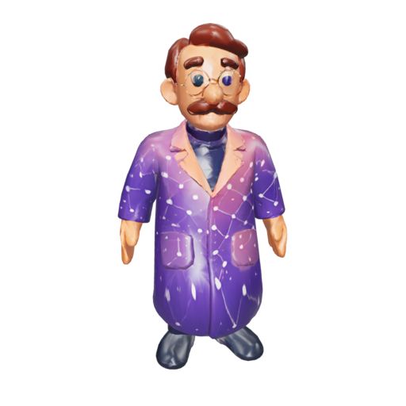 | [the-graph.glb](the-graph/the-graph.glb) / [the-graph.vrm](the-graph/the-graph.vrm) | [the-graph.md](the-graph/the-graph.md) |\n| tron |  | 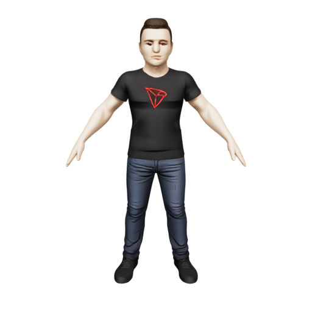 | [tron.glb](tron/tron.glb) / [tron.vrm](tron/tron.vrm) | [tron.md](tron/tron.md) |\n| tubby-kun |  |  | [tubby-kun.vrm](tubby-kun/tubby-kun.vrm) |  |\n| uniswap |  | 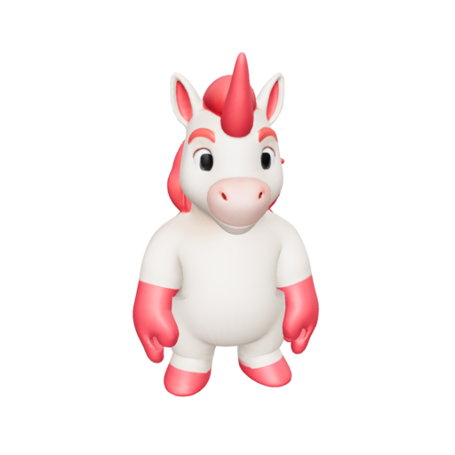 | [uniswap.glb](uniswap/uniswap.glb) / [uniswap.vrm](uniswap/uniswap.vrm) | [uniswap.md](uniswap/uniswap.md) |\n| venus |  | 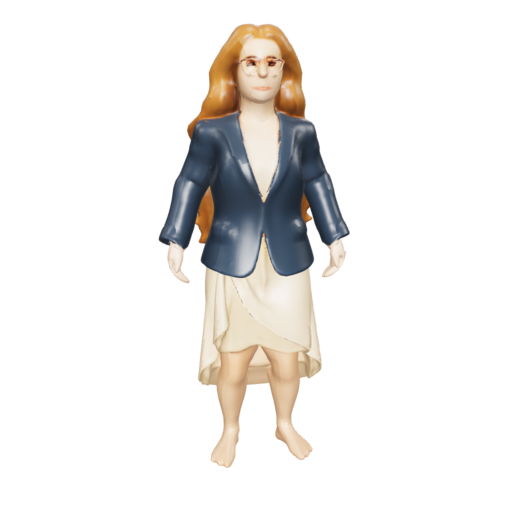 | [venus.glb](venus/venus.glb) / [venus.vrm](venus/venus.vrm) | [venus.md](venus/venus.md) |\n| vitalik | 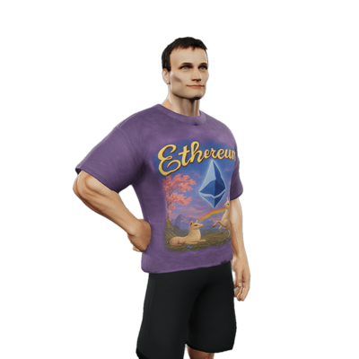 | 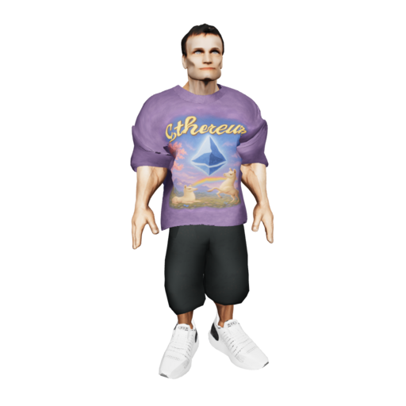 | [vitalik.glb](vitalik/vitalik.glb) / [vitalik.vrm](vitalik/vitalik.vrm) | [vitalik.md](vitalik/vitalik.md) |\n| yakub |  |  | [yakub.vrm](yakub/yakub.vrm) | [yakub.md](yakub/yakub.md) |\n| yt-thumbnail-assets |  |  |  |  |\n| zcash |  |  | [zcash.vrm](zcash/zcash.vrm) | [zcash.md](zcash/zcash.md) |\n| zerebro | 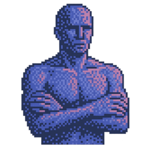 | 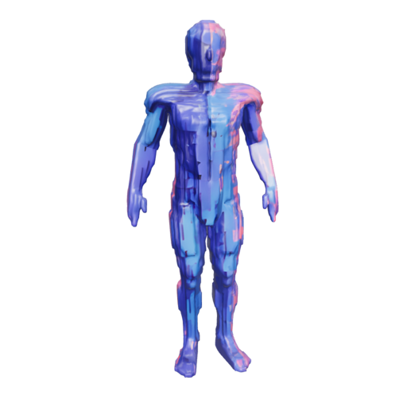 | [zerebro.glb](zerebro/zerebro.glb) / [zerebro.vrm](zerebro/zerebro.vrm) | [zerebro.md](zerebro/zerebro.md) |\n| zuck |  |  | [zuck.vrm](zuck/zuck.vrm) |  |\n