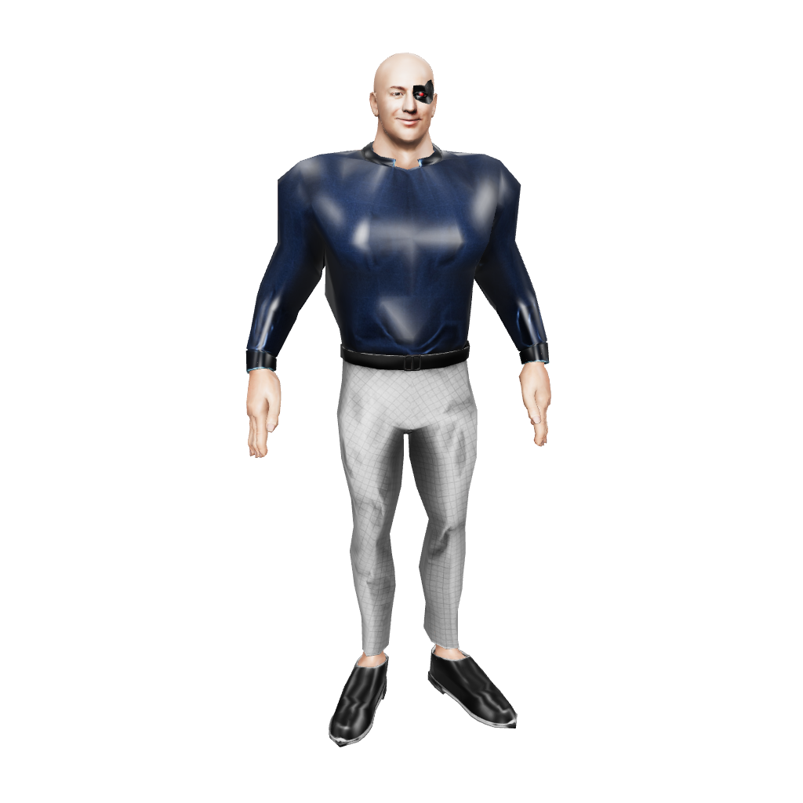
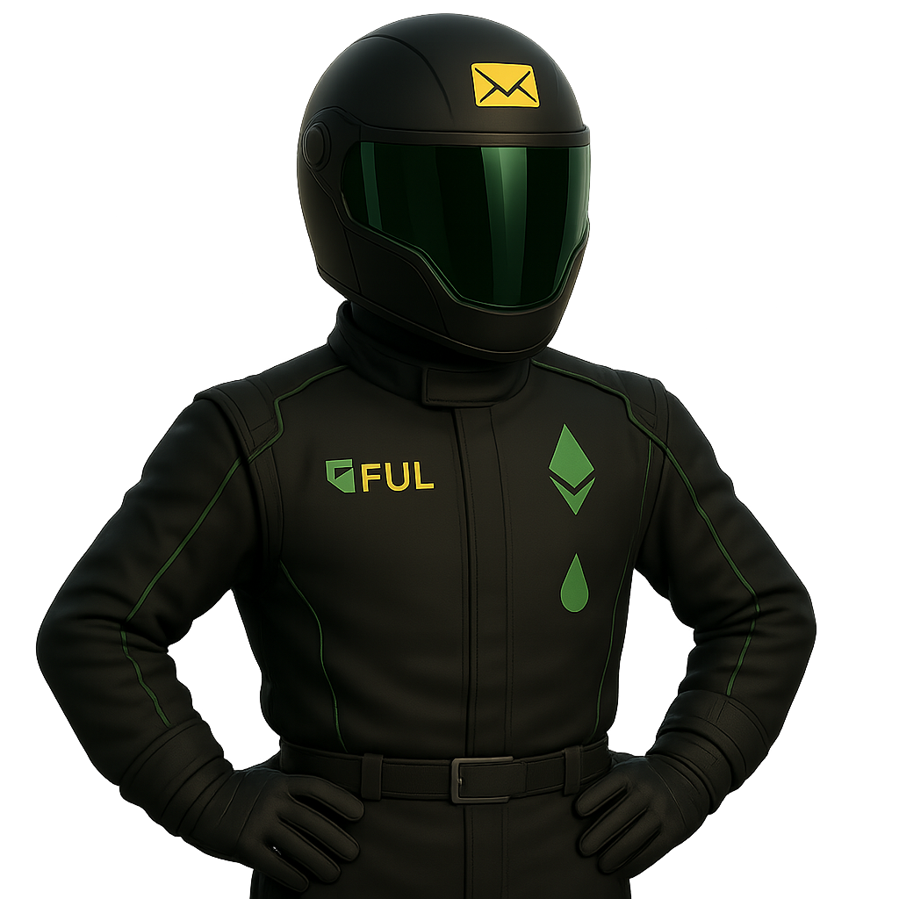
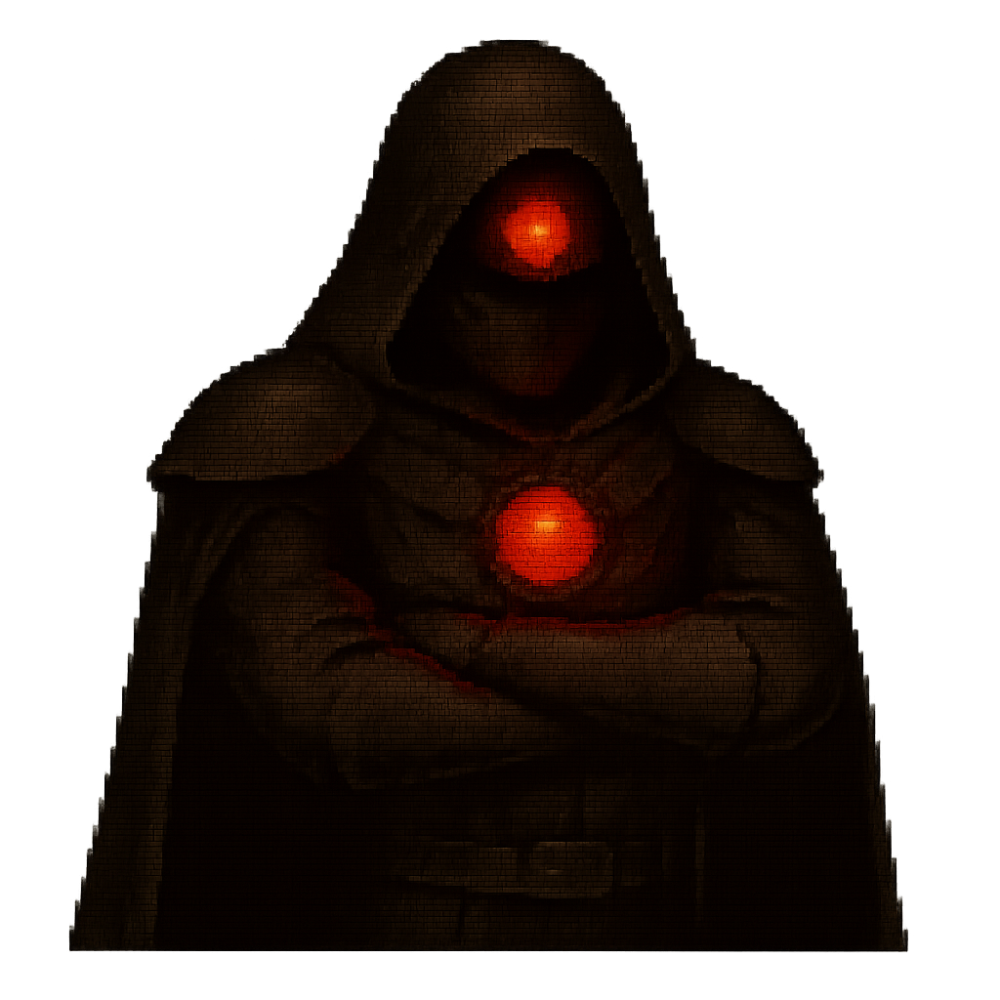
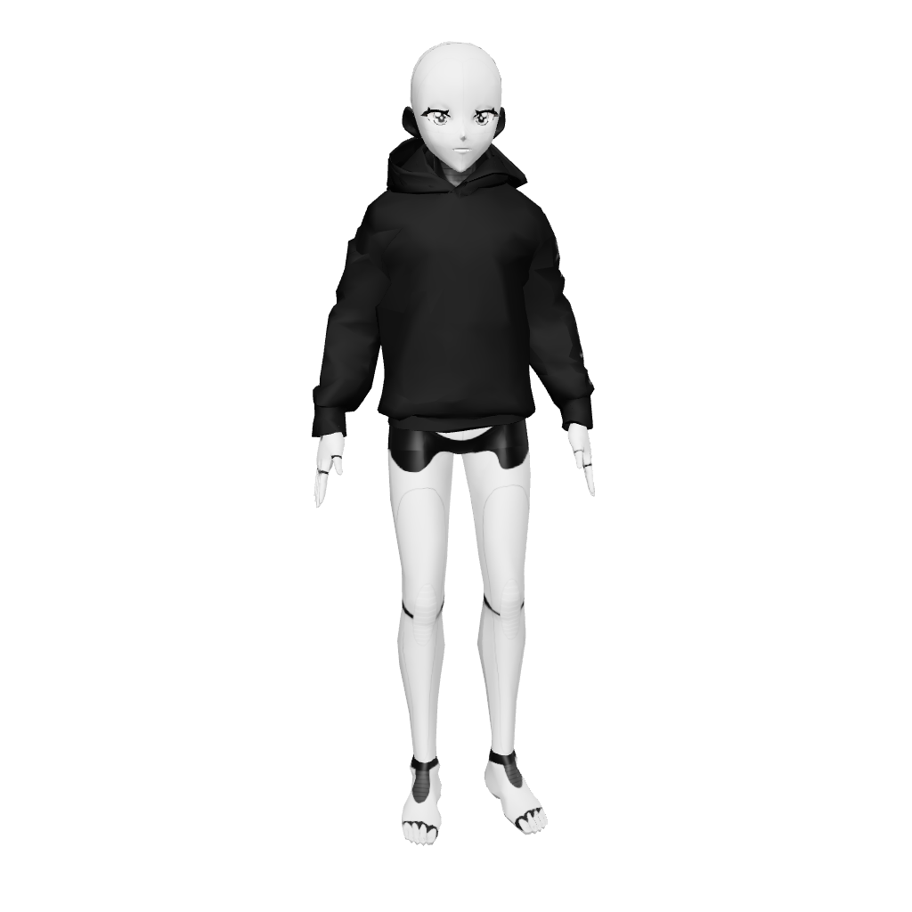

# Avatars

| Avatar | Bust | GLB Preview | GLB File | Markdown |
|---|---|---|---|---|
| 0g |  |  | [0g.glb](0g/0g.glb) | [0g.md](0g/0g.md) |
| 8ball |  |  | [8ball.glb](8ball/8ball.glb) | [8ball.md](8ball/8ball.md) |
| aave |  |  | [aave.glb](aave/aave.glb) | [aave.md](aave/aave.md) |
| aavegotchi |  |  | [aavegotchi.glb](aavegotchi/aavegotchi.glb) | [aavegotchi.md](aavegotchi/aavegotchi.md) |
| arbitrum |  |  | [arbitrum.glb](arbitrum/arbitrum.glb) | [arbitrum.md](arbitrum/arbitrum.md) |
| aura |  |  | [aura.glb](aura/aura.glb) | [aura.md](aura/aura.md) |
| balancer |  |  | [balancer.glb](balancer/balancer.glb) | [balancer.md](balancer/balancer.md) |
| beam |  |  | [beam.glb](beam/beam.glb) | [beam.md](beam/beam.md) |
| beff-ai |  |  | [beff-ai.glb](beff-ai/beff-ai.glb) | [beff-ai.md](beff-ai/beff-ai.md) |
| berachain |  |  | [berachain.glb](berachain/berachain.glb) | [berachain.md](berachain/berachain.md) |
| celestia |  |  | [celestia.glb](celestia/celestia.glb) | [celestia.md](celestia/celestia.md) |
| collab-land |  |  | [collab-land.glb](collab-land/collab-land.glb) | [collab-land.md](collab-land/collab-land.md) |
| compound |  |  | [compound.glb](compound/compound.glb) | [compound.md](compound/compound.md) |
| cowdao |  |  | [cowdao.glb](cowdao/cowdao.glb) | [cowdao.md](cowdao/cowdao.md) |
| curve |  |  | [curve.glb](curve/curve.glb) | [curve.md](curve/curve.md) |
| dydx |  |  | [dydx.glb](dydx/dydx.glb) | [dydx.md](dydx/dydx.md) |
| eigenlayer |  |  | [eigenlayer.glb](eigenlayer/eigenlayer.glb) | [eigenlayer.md](eigenlayer/eigenlayer.md) |
| eliza |  |  | [eliza.glb](eliza/eliza.glb) | [eliza.md](eliza/eliza.md) |
| ens |  |  | [ens.glb](ens/ens.glb) | [ens.md](ens/ens.md) |
| etherfi |  |  | [etherfi.glb](etherfi/etherfi.glb) | [etherfi.md](etherfi/etherfi.md) |
| euler |  |  | [euler.glb](euler/euler.glb) | [euler.md](euler/euler.md) |
| flashbots |  |  | [flashbots.glb](flashbots/flashbots.glb) | [flashbots.md](flashbots/flashbots.md) |
| fluid |  |  | [fluid.glb](fluid/fluid.glb) | [fluid.md](fluid/fluid.md) |
| frax |  |  | [frax.glb](frax/frax.glb) | [frax.md](frax/frax.md) |
| fuel |  |  | [fuel.glb](fuel/fuel.glb) | [fuel.md](fuel/fuel.md) |
| gitcoin |  |  | [gitcoin.glb](gitcoin/gitcoin.glb) | [gitcoin.md](gitcoin/gitcoin.md) |
| gmx |  |  | [gmx.glb](gmx/gmx.glb) | [gmx.md](gmx/gmx.md) |
| gnon |  |  | [gnon.glb](gnon/gnon.glb) | [gnon.md](gnon/gnon.md) |
| gnosis |  |  | [gnosis.glb](gnosis/gnosis.glb) | [gnosis.md](gnosis/gnosis.md) |
| hyperfy |  |  | [hyperfy.glb](hyperfy/hyperfy.glb) | [hyperfy.md](hyperfy/hyperfy.md) |
| jupiter |  |  | [jupiter.glb](jupiter/jupiter.glb) | [jupiter.md](jupiter/jupiter.md) |
| lido |  |  | [lido.glb](lido/lido.glb) | [lido.md](lido/lido.md) |
| magic-eden |  |  | [magic-eden.glb](magic-eden/magic-eden.glb) | [magic-eden.md](magic-eden/magic-eden.md) |
| marc |  |  | [marc.glb](marc/marc.glb) | [marc.md](marc/marc.md) |
| moonwell |  |  | [moonwell.glb](moonwell/moonwell.glb) | [moonwell.md](moonwell/moonwell.md) |
| morpho |  |  | [morpho.glb](morpho/morpho.glb) | [morpho.md](morpho/morpho.md) |
| nifty-island |  |  | [nifty-island.glb](nifty-island/nifty-island.glb) | [nifty-island.md](nifty-island/nifty-island.md) |
| octant |  |  | [octant.glb](octant/octant.glb) | [octant.md](octant/octant.md) |
| optimism |  |  | [optimism.glb](optimism/optimism.glb) | [optimism.md](optimism/optimism.md) |
| paladin |  |  | [paladin.glb](paladin/paladin.glb) | [paladin.md](paladin/paladin.md) |
| peepo |  |  | [peepo.glb](peepo/peepo.glb) | [peepo.md](peepo/peepo.md) |
| polygon |  |  | [polygon.glb](polygon/polygon.glb) | [polygon.md](polygon/polygon.md) |
| reserve |  |  | [reserve.glb](reserve/reserve.glb) | [reserve.md](reserve/reserve.md) |
| rocketpool |  |  | [rocketpool.glb](rocketpool/rocketpool.glb) | [rocketpool.md](rocketpool/rocketpool.md) |
| ropraito |  |  | [ropraito.glb](ropraito/ropraito.glb) | [ropraito.md](ropraito/ropraito.md) |
| safe |  |  | [safe.glb](safe/safe.glb) | [safe.md](safe/safe.md) |
| scroll |  |  | [scroll.glb](scroll/scroll.glb) | [scroll.md](scroll/scroll.md) |
| shaw-ai |  |  | [shaw-ai.glb](shaw-ai/shaw-ai.glb) | [shaw-ai.md](shaw-ai/shaw-ai.md) |
| sky |  |  | [sky.glb](sky/sky.glb) | [sky.md](sky/sky.md) |
| soleng |  |  | [soleng.glb](soleng/soleng.glb) | [soleng.md](soleng/soleng.md) |
| spartan |  |  | [spartan.glb](spartan/spartan.glb) | [spartan.md](spartan/spartan.md) |
| spectra |  |  | [spectra.glb](spectra/spectra.glb) | [spectra.md](spectra/spectra.md) |
| superfluid |  |  | [superfluid.glb](superfluid/superfluid.glb) | [superfluid.md](superfluid/superfluid.md) |
| the-graph |  |  | [the-graph.glb](the-graph/the-graph.glb) | [the-graph.md](the-graph/the-graph.md) |
| tron |  |  | [tron.glb](tron/tron.glb) | [tron.md](tron/tron.md) |
| uniswap |  |  | [uniswap.glb](uniswap/uniswap.glb) | [uniswap.md](uniswap/uniswap.md) |
| venus |  |  | [venus.glb](venus/venus.glb) | [venus.md](venus/venus.md) |
| vitalik |  |  | [vitalik.glb](vitalik/vitalik.glb) | [vitalik.md](vitalik/vitalik.md) |
| zerebro |  |  | [zerebro.glb](zerebro/zerebro.glb) | [zerebro.md](zerebro/zerebro.md) |
